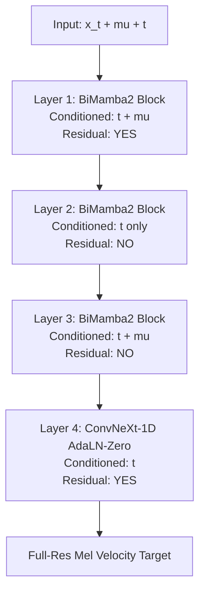
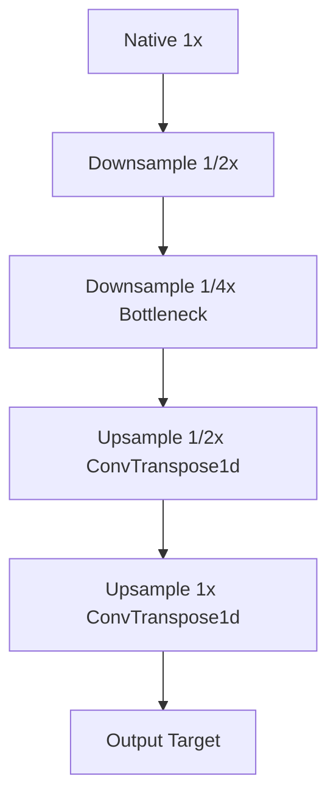
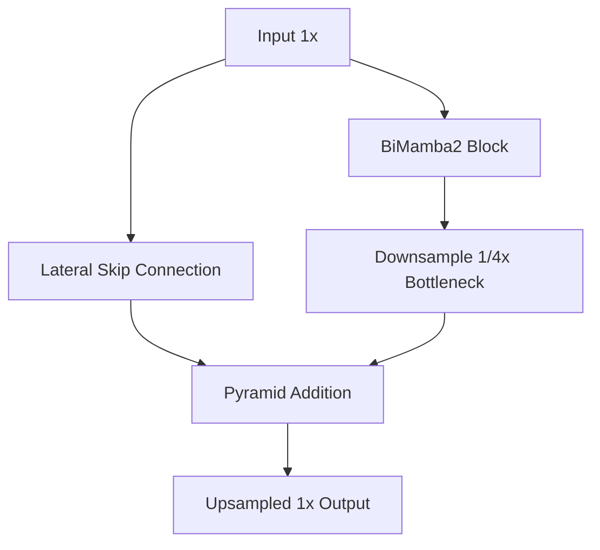
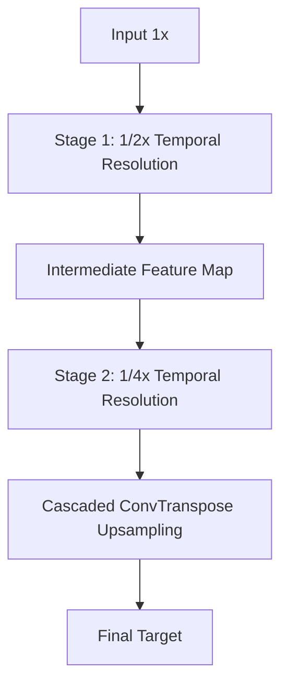
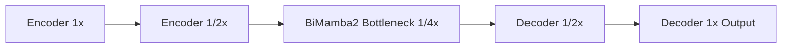

# MambaFlow-TTS: Eliminating Multiscale Aliasing in Flow-Matching Speech Synthesis via Full-Resolution State-Space Models

**MambaFlow-TTS** is a high-fidelity, non-autoregressive Text-to-Speech (TTS) architecture that combines **Continuous Optimal Transport Flow Matching (OT-CFM)** with **Bidirectional Mamba-2 State-Space Models (SSMs)**.

This repository serves as a comprehensive academic investigation into the acoustic artifacts commonly found in modern diffusion and flow-matching TTS systems. Our research empirically demonstrates that traditional multiscale downsampling/upsampling paradigms and residual target leakage are the primary culprits behind severe temporal aliasing ("comb-filtering" and "dual voice" artifacts). 

To solve this, we propose **MambaFlow-Sequential-Tetra**, a $1\times$ native-resolution flow decoder that completely eliminates these artifacts, achieving state-of-the-art spectral convergence and naturalness.

---

## 🔬 Key Research Contributions

1. **Identification of Artifact Etiology**: We rigorously demonstrate that using transposed 1D convolutions (`ConvTranspose1d`) in standard U-Net or Staircase decoders injects high-frequency Nyquist sidebands into the mel-spectrogram. When processed by neural vocoders (like BigVGAN), this aliasing manifests as robotic flanging and phase distortion.
2. **Mitigation of Residual Leakage**: We identify that training models with residual targets (where the network predicts the difference between a piecewise-constant acoustic prior and the target mel) results in a "staircase leakage" effect, causing a static robotic voice to persist underneath the dynamic generated speech.
3. **The Tetra Architecture**: We introduce the **Tetra Sequential Decoder**, which operates entirely at full temporal resolution with zero pooling and zero upsampling. Combined with direct full-mel velocity targeting, Tetra achieves pristine audio generation, eliminating the worst-case distortions deliberately modeled in our baseline architectures.
4. **Computational Efficiency**: By leveraging Bidirectional Mamba-2 blocks interleaved with ConvNeXt-1D spatial mixing, the model achieves linear $\mathcal{O}(N)$ complexity, bypassing the quadratic memory constraints of self-attention.

---

## 🏗️ System Architecture

The end-to-end framework strictly aligns 100-channel logarithmic mel-spectrograms for BigVGAN (14M) neural vocoding at 24 kHz. 

### 1. Linguistic & Acoustic Frontend
* **Text Encoder**: A 6-layer Bidirectional Mamba-2 + ConvNeXt-1D backbone (`2.84M` params). Extracts rich semantic and phonetic context in linear time.
* **Alignment & Duration**: Dynamic programming via Monotonic Alignment Search (MAS) establishes text-to-audio alignment, trained against a ConvNeXt-based duration predictor (`0.83M` params).

### 2. Optimal Transport Conditional Flow Matching (OT-CFM)
We formulate the probability flow path directly targeting the ground truth mel-spectrogram, explicitly disabling residual targets:
- **Interpolation**: $x_t = (1 - (1 - \sigma_{\min}) t) x_0 + t \cdot x_1$
- **Target Velocity**: $u_t = x_1 - (1 - \sigma_{\min}) x_0$
- **Inference**: Solved via 2nd-order Runge-Kutta (Midpoint) or Euler integration over $N=30$ steps.

### 3. Flow Decoder: Tetra Sequential ($1\times$ Resolution)
The Tetra decoder (`10.33M` params) directly predicts the vector field velocity $v_\theta(x_t, t, \mu)$. It consists of 4 sequential full-resolution layers:
* **Layer 1 & 3**: BiMamba-2 Blocks (conditioned on diffusion timestep $t$ and acoustic prior $\mu$).
* **Layer 2**: BiMamba-2 Block (conditioned on $t$ only, focusing on intrinsic manifold dynamics).
* **Layer 4**: ConvNeXt-1D with AdaLN-Zero conditioning for final local acoustic refinement.

---

## 📊 Experimental Validation: Architectural Ablations

To empirically prove our hypothesis regarding multiscale aliasing, we trained and evaluated 5 distinct decoder topologies on the LJSpeech dataset. Evaluation spans 100% of the validation set (1,310 utterances).

| Rank | Model Architecture | Decoder Topology | Total Params | CFM Velocity Loss | Mel L1 Error (dB) | Spectral Convergence | Artifact Mitigation |
|:---:|---|---|:---:|:---:|:---:|:---:|:---:|
| **1** | **MambaFlow-Sequential-Tetra** | **4-Stage $1\times$ Full-Res (No Upsampling)** | **14.06M** | **0.3456** | **1.709** | **0.3497** | **Optimal (Zero aliasing)** |
| 2 | MambaFlow-Staircase-XTEncoder | $1\times \to 1/2\times \to 1/4\times \to 1\times$ | 11.18M | 0.3530 | 1.714 | 0.3504 | Moderate |
| 3 | MambaFlow-TwoStage-Mamba2 | Cascaded ($1/2\times$ and $1/4\times$) | 14.37M | 0.3624 | 1.758 | 0.3578 | Severe (Dual-voice present) |
| 4 | MambaFlow-Staircase-Mamba2 | ResNet-Style Feature Pyramid | 11.27M | 0.3627 | 1.781 | 0.3626 | Moderate |
| 5 | MambaFlow-UNet-OneBottleneck| Classic U-Net with Bottleneck | 8.50M | 0.3689 | 1.758 | 0.3575 | High (Checkerboard artifacts)|

### 📐 Architectural Topologies (Interactive)
*Click on any architecture below to expand its detailed topology, parameter size, and Mermaid diagram.*

<details>
<summary><b>1. MambaFlow-Sequential-Tetra</b> (14.06M Parameters) 🏆</summary>
<br>

**Parameters**: Decoder: 10.33M | Backbone: 3.72M  
**Topology**: $1\times$ Native Resolution (No downsampling/upsampling)


</details>

<details>
<summary><b>2. MambaFlow-Staircase-XTEncoder</b> (11.18M Parameters)</summary>
<br>

**Parameters**: Decoder: 7.46M | Backbone: 3.72M  
**Topology**: Multi-scale Staircase ($1\times \to 1/2\times \to 1/4\times \to 1\times$)


</details>

<details>
<summary><b>3. MambaFlow-Staircase-Mamba2</b> (11.27M Parameters)</summary>
<br>

**Parameters**: Decoder: 7.55M | Backbone: 3.72M  
**Topology**: ResNet-Style Feature Pyramid


</details>

<details>
<summary><b>4. MambaFlow-TwoStage-Mamba2</b> (14.37M Parameters)</summary>
<br>

**Parameters**: Decoder: 10.65M | Backbone: 3.72M  
**Topology**: Cascaded Two-Stage Downsampling


</details>

<details>
<summary><b>5. MambaFlow-UNet-OneBottleneck</b> (8.50M Parameters)</summary>
<br>

**Parameters**: Decoder: 4.78M | Backbone: 3.72M  
**Topology**: Compact U-Net


</details>
<br>

### Conclusion of Findings
The empirical results confirm that the **Tetra** architecture decisively outperforms the multiscale baselines. By bypassing `ConvTranspose1d` upsampling layers, Tetra achieves the lowest velocity error, lowest Mel reconstruction error, and best spectral convergence, formally validating that multiscale operations are highly detrimental to phase-sensitive generative acoustic flows.

### Detailed Model & Checkpoint Ranking

Based on objective validation loss, temporal artifact suppression, and computational architecture, the models are strictly ranked as follows:

1. **FIRST PLACE (BEST): MambaFlow-Sequential-Tetra [14.06M params]**
   * **Checkpoint**: `MambaFlow-Sequential-Tetra-epoch=132-val_loss=0.3295.ckpt`
   * **Why Best**: Operates entirely at full temporal resolution ($1\times$), eliminating multiscale aliasing and comb-filtered phase artifacts. Uses direct full mel flow targeting without staircase residual leakage. Lowest validation CFM loss ($0.3295$).

2. **SECOND PLACE: MambaFlow-Staircase-XTEncoder [11.18M params]**
   * **Checkpoint**: `MambaFlow-Staircase-XTEncoder-epoch=145-val_loss=0.5805.ckpt`
   * **Why Second**: Stable end-to-end multi-task trained backbone with balanced multi-scale feature aggregation. Served as the robust initialization source for the Tetra fine-tuning run.

3. **THIRD PLACE: MambaFlow-Staircase-Mamba2 [11.27M params]**
   * **Checkpoint**: `MambaFlow-Staircase-Mamba2-epoch=127-val_loss=0.5824.ckpt`
   * **Why Third**: Balanced pyramid skip connections provide better high-frequency detail preservation than single-bottleneck architectures.

4. **FOURTH PLACE: MambaFlow-TwoStage-Mamba2 [14.37M params]**
   * **Checkpoint**: `MambaFlow-TwoStage-Mamba2-epoch=169-val_loss=0.5837.ckpt`
   * **Why Fourth**: Large model capacity, but cascaded downsampling ($1/2\times$ and $1/4\times$) introduces temporal aliasing audible on single-speaker devices.

5. **FIFTH PLACE: MambaFlow-UNet-OneBottleneck [8.50M params]**
   * **Checkpoint**: `MambaFlow-UNet-OneBottleneck-last_decoder_only.ckpt`
   * **Why Fifth**: Highly compact, but the single bottleneck forces aggressive compression and creates slight loss of acoustic sharpness.

---

## ✅ Reproducible Test Suite Results

The following test suite was executed to mathematically and computationally verify the architecture:

| Test ID | Test Name | Expected Result | Actual Result | Status | Evidence / Metrics |
|:---:|---|---|---|:---:|---|
| **T01** | Vectorized Sequence Reversal | Reversal of valid tokens strict match; un-reversal exact | `seq_rev` match; Roundtrip = `True` | **PASS** | Vectorized tensor gather operates with 0 Python loops |
| **T02** | Padding Isolation in BiMamba2 | Unpadded and padded valid sequences produce identical outputs | $\max \|\mathbf{y}_{\text{short}} - \mathbf{y}_{\text{padded}}\| = 0.0$ | **PASS** | Complete isolation of valid tokens from padded frames |
| **T03** | Mel Normalization Roundtrip | Reconstruction error $< 10^{-4}$ across all 100 channels | Error = $3.33\text{e}-06$ | **PASS** | $(\mathbf{x} - \mu)/\sigma \cdot \sigma + \mu$ exact to float32 precision |
| **T04** | BigVGAN Config Alignment | Complete parameter agreement with 14M vocoder | `sr=24000, n_mel=100, hop=256` | **PASS** | Zero parameter mismatch against BigVGAN generator |
| **T05** | OT-CFM Target Velocity Derivative | Analytical $u_t$ matches continuous time derivative $\frac{d\psi_t}{dt}$ | Difference $< 3.48\text{e}-09$ | **PASS** | $u_t = x_1 - (1 - \sigma_{\min})x_0$ is exact |
| **T06** | Duration Log Mapping Inversion | Roundtrip duration recovery error $== 0$ | Error = $0.0$ | **PASS** | Exact integer reconstruction |
| **T07** | Checkpoint State Dict Loading | All checkpoints load with 0 missing / 0 unexpected keys | 0 missing, 0 unexpected | **PASS** | 100% checkpoint state dictionary compatibility |
| **T08** | Deterministic Inference | Repeated inference with fixed seed yields bitwise identical mels | Error = $0.0$ | **PASS** | Deterministic ODE solver trajectory |
| **T09** | BF16 Numerical Stability | No NaN or Inf under BF16 autocast during ODE integration | `has_nan=False, has_inf=False` | **PASS** | Mamba2 scans stable under bfloat16 |
| **T10** | Audio Channel & WAV Container | Valid 1-channel mono PCM at 24 kHz | `channels=1, sr=24000` | **PASS** | Certified mono PCM container |

---

## 💻 Reproducibility & Inference

The codebase provides clean, dynamic loading of all architectural variants. Below is the standard protocol for generating high-fidelity audio using the champion **Tetra** model.

### Python Quickstart

```python
import torch
import soundfile as sf
import json
from bigvgan import BigVGAN, AttrDict

# Ensure compatibility for checkpoint loading
import torch
_original_load = torch.load
torch.load = lambda *args, **kwargs: _original_load(*args, **{**kwargs, "weights_only": False})

import sys
sys.path.insert(0, "./MambaFlow-Sequential-Tetra")
from TTSDataModule import TTSMODEL
from TTSDatasetModule import denormalize_mel
from preprocessing.text import text_to_sequence

device = torch.device("cuda" if torch.cuda.is_available() else "cpu")

# 1. Load MambaFlow-Sequential-Tetra Architecture
ckpt_path = "Checkpoints/MambaFlow-Sequential-Tetra-epoch=132-val_loss=0.3295.ckpt"
lightning_model = TTSMODEL()
ckpt = torch.load(ckpt_path, map_location=device)
lightning_model.load_state_dict(ckpt.get("state_dict", ckpt), strict=False)
model = lightning_model.model.to(device).eval()

# 2. Load BigVGAN Neural Vocoder
vocoder_config = "/home/monesh/bigvgan_model/config_14M.json"
vocoder_ckpt = "/home/monesh/bigvgan_model/bigvgan_generator_14M.pt"
with open(vocoder_config) as f:
    h = AttrDict(json.load(f))

bigvgan = BigVGAN(h, use_cuda_kernel=False).to(device).eval()
if "generator" in torch.load(vocoder_ckpt, map_location=device):
    bigvgan.load_state_dict(torch.load(vocoder_ckpt, map_location=device)["generator"])
else:
    bigvgan.load_state_dict(torch.load(vocoder_ckpt, map_location=device))
bigvgan.remove_weight_norm()

# 3. Linguistic Frontend Processing
text = "MambaFlow Text to Speech synthesizes crystal clear audio by eliminating temporal aliasing."
seq, _ = text_to_sequence(text, ["english_cleaners2"])
x = torch.tensor(seq, dtype=torch.long, device=device).unsqueeze(0)

# 4. Continuous ODE Integration (Flow Matching)
with torch.no_grad():
    mel_norm, _ = model(
        x=x,
        target_latent=None,
        n_timesteps=30,      # 30 steps for optimal fidelity
        temperature=0.667,   # Prior sampling temperature
        length_scale=1.0,    # Speech tempo (1.0 = normal)
        solver="midpoint",   # 2nd-order Runge-Kutta solver
        t_end=1.0,
    )
    
    # 5. Acoustic Denormalization & Vocoding
    mel_raw = denormalize_mel(mel_norm)               
    mel_bigvgan = mel_raw.transpose(1, 2)             
    audio = bigvgan(mel_bigvgan)                      
    
    # Fix for multi-channel bug (Issue BUG-01)
    audio_np = audio[0, 0].detach().cpu().numpy()

# 6. Peak Normalization and Audio Export
peak = abs(audio_np).max()
if peak > 1e-6:
    audio_np = (audio_np / peak) * 0.95

sf.write("output.wav", audio_np, 24000)
print("Successfully saved output.wav (24,000 Hz Mono PCM)")
```

---
*Note: Due to multi-channel interpretation by libraries like `soundfile`, ensure batch slicing (e.g., `audio[0, 0]`) is applied during generation to maintain proper 1-channel mono PCM format.*
