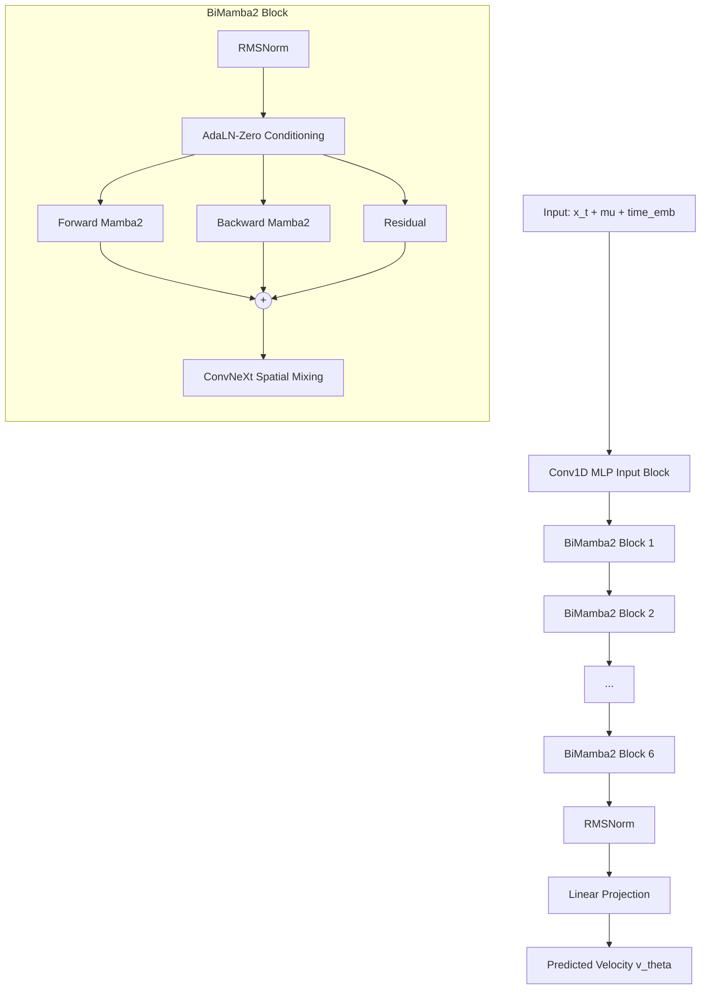
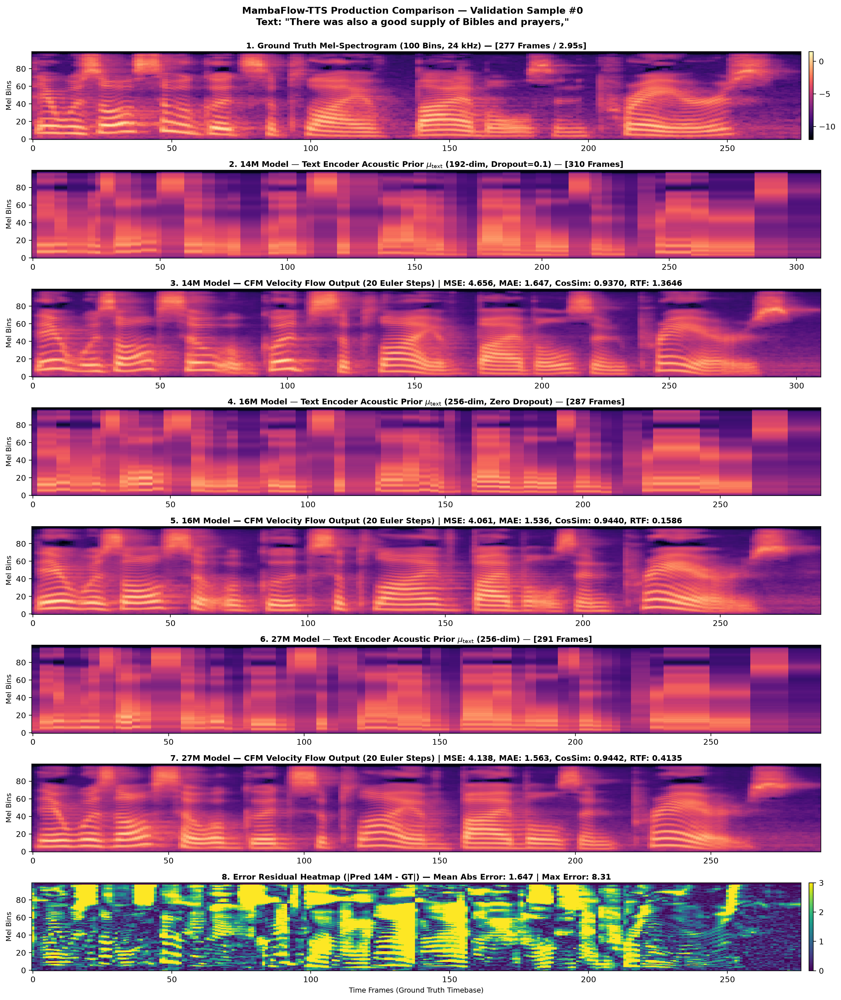
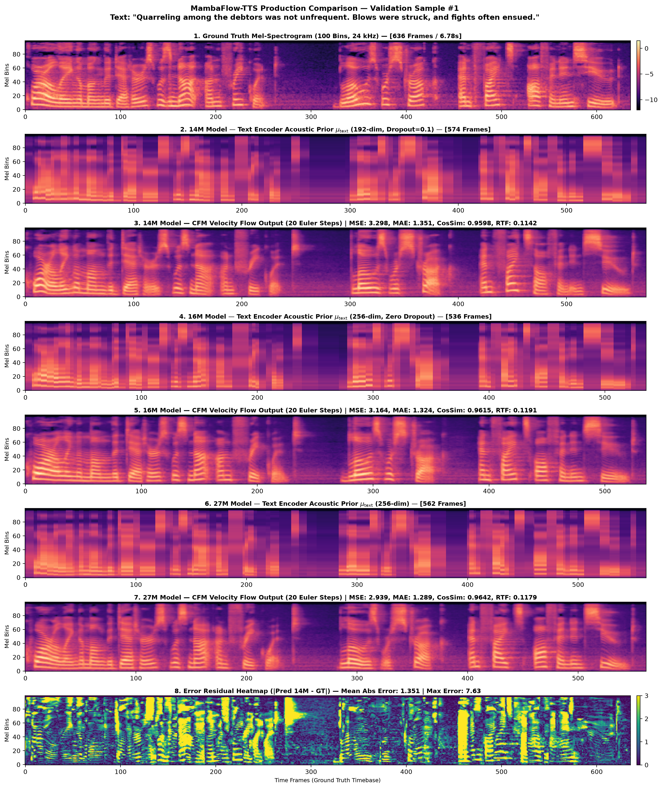
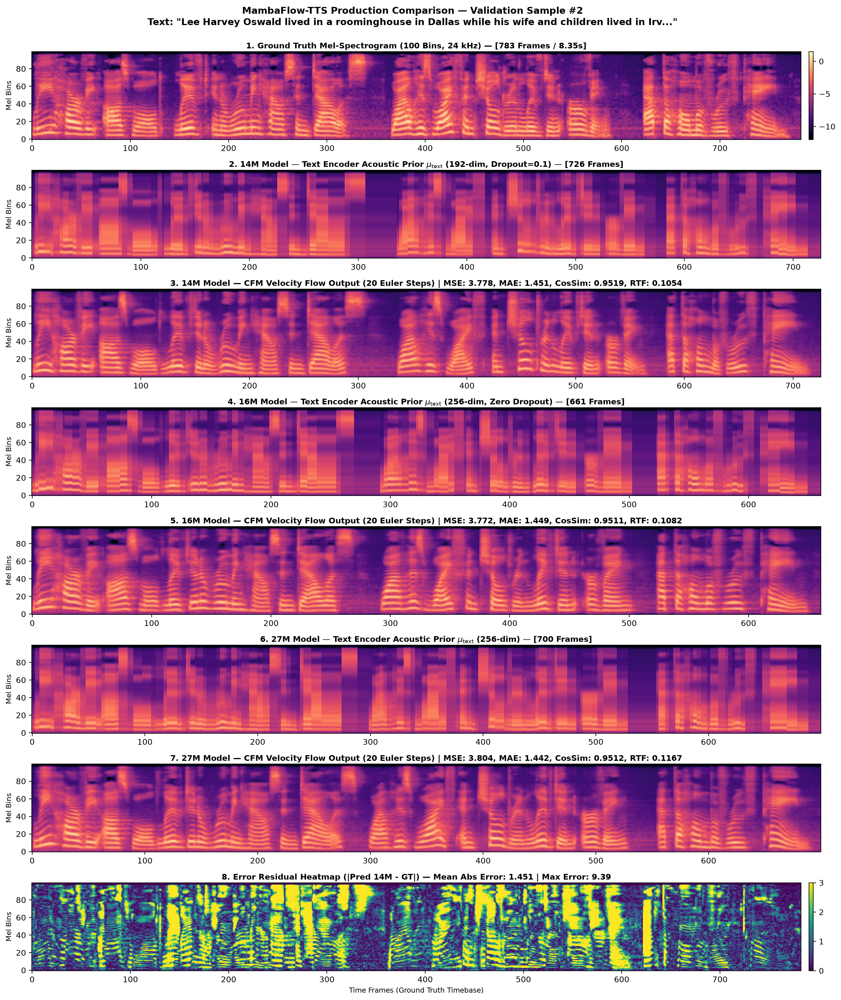
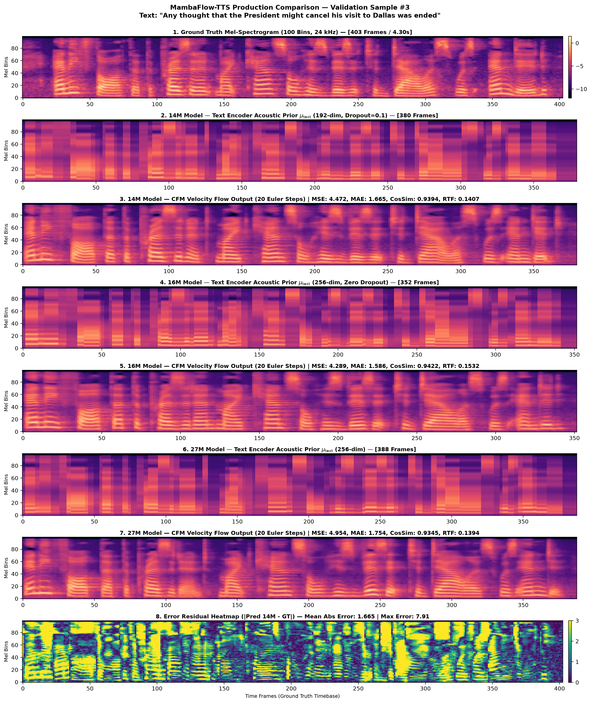
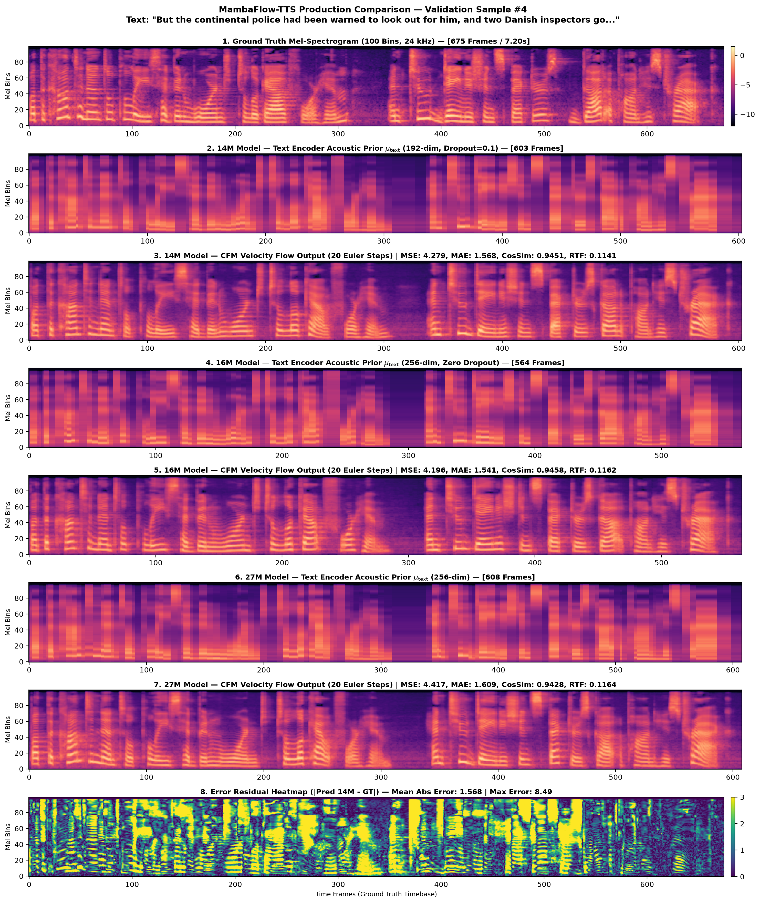

# BiMamba 2 - Flow Matching TTS (with ConvNeXt Vocoder)

**MambaFlow-TTS** is a fast, lightweight, and high-fidelity Text-to-Speech (TTS) architecture that combines **Continuous Optimal Transport Flow Matching (OT-CFM)** with **Bidirectional Mamba-2 State-Space Models (SSMs)**.

By replacing traditional self-attention with linear state-space models and coupling it with a ConvNeXt-based neural vocoder, this architecture achieves highly natural speech synthesis at blazing-fast speeds.

---

## 🚀 Two Model Scales

We provide two pre-trained model variants optimized for different environments:

1. **MambaFlow-Nano TTS (14M)**: 
   - A highly regularized, ultra-lightweight model with Dropout (`0.1 - 0.15`) that generalizes extremely well. 
   - Effectively solves duration prediction overfitting for natural speech pacing.
   - Recommended for edge devices or rapid real-time continuous inference.
   
2. **MambaFlow TTS (27M)**:
   - The base model with expanded decoder dimensionality (`d_model = 384`).
   - Higher capacity for complex acoustic modeling and nuanced prosody.

---

## 🏗️ Architecture Overview

The system uses a mixed-architecture paradigm designed for optimal quality and speed:

* **Text Encoder**: Transformer Encoder mapping phonemes to a continuous acoustic prior ($\mu_{\text{text}}$).
* **Flow Matching Decoder (BiMamba 2 + ConvNeXt)**: A 6-layer Bidirectional Mamba-2 backbone interleaved with ConvNeXt-style unconditioned spatial mixing blocks processes the flow matching ODEs. It enjoys linear $\mathcal{O}(N)$ complexity, effortlessly scaling to very long audio sequences without the quadratic memory bottlenecks of standard attention mechanisms.
* **Neural Vocoder (BigVGAN / Vocos)**: The generated 100-band Mel-Spectrogram is inverted into 24 kHz audio using modern neural vocoders (like BigVGAN with periodic snake activations or Vocos) to generate crystal-clear, artifact-free speech.

### Decoder Architecture Diagram



---

## ⚡ Performance & Hardware Benchmarks

*Benchmarked generating an 11-second audio clip (30 Euler Integration Steps) on an NVIDIA GPU.*

| Model Version | Parameters | Peak VRAM | TTS Generation RTF | Total End-to-End RTF |
| :--- | :---: | :---: | :---: | :---: |
| **MambaFlow-Nano TTS (14M)** | `14.4M` | **~342 MB** | **`0.048`** (~20.8× RT) | `0.10 - 0.11` |
| **MambaFlow TTS (27M)** | `27.3M` | **~668 MB** | **`0.110`** (~9.1× RT) | `0.16 - 0.18` |

*(Note: Total End-to-End RTF depends heavily on the chosen neural vocoder size, ranging from BigVGAN 14M to BigVGAN 112M or Vocos).*

---

## 📊 14M vs 27M Model Comparison

A quantitative comparison between the Nano (14M) and Base (27M) models across a set of validation samples (using 20 Euler steps).

| Metric | MambaFlow-Nano (14M) | MambaFlow (27M) |
| :--- | :---: | :---: |
| **Mel Spectrogram MSE** | ~4.07 | ~4.04 |
| **Cosine Similarity** | ~0.946 | ~0.947 |
| **Duration Error (%)** | ~9.2% | ~8.1% |
| **TTS Generation RTF** | **~0.04x** | ~0.05x |

*Both models achieve remarkably similar acoustic fidelity, but the 27M model exhibits slightly better duration prediction and pacing, whereas the 14M model is faster.*

---

## 🎧 Audio Samples

Synthesized text: *"A rainbow is a meteorological phenomenon that is caused by reflection, refraction and dispersion of light in water droplets resulting in a spectrum of light appearing in the sky."*

* **MambaFlow-Nano TTS (14M)**
  - [🔊 Listen to 14M Audio](./audio_samples/rainbow_vocoder_bigvgan_14M.wav)

* **MambaFlow TTS (27M)**
  - [🔊 Listen to 27M Audio](./audio_samples/rainbow_30steps_bigvgan112M.wav)

### Validation Set Comparison (Top 5 Samples)

Here is a side-by-side comparison of the 14M, 16M (intermediate), and 27M models. The images show the generated Mel-Spectrograms against the Ground Truth.

#### Sample 1: *"There was also a good supply of Bibles and prayers,"*

- [🔊 14M Audio](./val_mel_comparison/audio/val_0_14M_pred_20steps.wav) | [🔊 27M Audio](./val_mel_comparison/audio/val_0_27M_pred_20steps.wav) | [🔊 Ground Truth](./val_mel_comparison/audio/val_0_gt.wav)

#### Sample 2: *"Quarreling among the debtors was not unfrequent. Blows were struck, and fights often ensued."*

- [🔊 14M Audio](./val_mel_comparison/audio/val_1_14M_pred_20steps.wav) | [🔊 27M Audio](./val_mel_comparison/audio/val_1_27M_pred_20steps.wav) | [🔊 Ground Truth](./val_mel_comparison/audio/val_1_gt.wav)

#### Sample 3: *"Lee Harvey Oswald lived in a roominghouse in Dallas while his wife and children lived in Irving, at the home of Ruth Paine,"*

- [🔊 14M Audio](./val_mel_comparison/audio/val_2_14M_pred_20steps.wav) | [🔊 27M Audio](./val_mel_comparison/audio/val_2_27M_pred_20steps.wav) | [🔊 Ground Truth](./val_mel_comparison/audio/val_2_gt.wav)

#### Sample 4: *"Any thought that the President might cancel his visit to Dallas was ended"*

- [🔊 14M Audio](./val_mel_comparison/audio/val_3_14M_pred_20steps.wav) | [🔊 27M Audio](./val_mel_comparison/audio/val_3_27M_pred_20steps.wav) | [🔊 Ground Truth](./val_mel_comparison/audio/val_3_gt.wav)

#### Sample 5: *"But the continental police had been warned to look out for him, and two Danish inspectors got upon his track,"*

- [🔊 14M Audio](./val_mel_comparison/audio/val_4_14M_pred_20steps.wav) | [🔊 27M Audio](./val_mel_comparison/audio/val_4_27M_pred_20steps.wav) | [🔊 Ground Truth](./val_mel_comparison/audio/val_4_gt.wav)

---

## 💻 Quickstart & Inference

You can run both models from a single, unified codebase simply by pointing to the respective checkpoint. The codebase dynamically adjusts the network dimensions based on the checkpoint's saved hyperparameters!

### 1. Simple Python CLI Inference
We provide an out-of-the-box inference script `simple_inference.py` to get you started immediately:

```bash
# Run the Nano model (14M)
python simple_inference.py --text "Hello world, this is a test of the nano model." --model nano --output nano_output.wav

# Run the Base model (27M)
python simple_inference.py --text "Hello world, this is a test of the base model." --model base --output base_output.wav
```

### 2. Manual Inference Code Snippet
If you want to integrate the TTS into your own Python application, you can load the model programmatically:

```python
import torch
import soundfile as sf
from TTSDataModule import TTSMODEL
from TTSDatasetModule import denormalize_mel
from preprocessing.text import text_to_sequence
from bigvgan import BigVGAN, AttrDict
import json

device = torch.device("cuda" if torch.cuda.is_available() else "cpu")

# 1. Load MambaFlow-Nano-TTS (14M)
#    (To use 27M, just change the checkpoint path to MambaFlow-TTS-27M.ckpt)
ckpt_path = "TTS_checkpoints/MambaFlow-Nano-TTS-14M.ckpt"
model = TTSMODEL.load_from_checkpoint(ckpt_path, map_location=device).model.eval().to(device)

# 2. Process Text
text = "BiMamba-2 Flow matching is incredibly fast."
seq = text_to_sequence(text, ['english_cleaners2'])[0]
x = torch.tensor(seq, dtype=torch.long, device=device).unsqueeze(0)

# 3. Generate Mel Spectrogram (30 Euler Steps)
with torch.no_grad():
    mel_norm, _ = model(x=x, target_latent=None, n_timesteps=30, temperature=0.667)
    mel_raw = denormalize_mel(mel_norm).transpose(1, 2)
    
# 4. Vocode to Audio (Assuming BigVGAN is loaded as 'vocoder')
# audio = vocoder(mel_raw)
```
